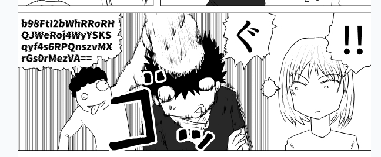

[English is here](./README_en.md)  

# このリポジトリについて

[自分の漫画サイトRESIGN THREAT](https://www.resign-threat.com/)に登場する敵キャラが喋ってる暗号を平文に復号するためのサンプルプログラムです。これ使って暗号解いてください！そしてSNSで拡散してください！よろしくお願いします

# 使い方(DES-ECBを複合)

1. 漫画を読んで暗号喋ってる場面を見つけてください。例えば以下のような場面です。ちなみにこれは[第1話の7ページ目](https://www.resign-threat.com/story/01#01-07)です。
   
2. 画像をクリックorタップします。モーダルが開きます。
   
3. 上記画像の赤枠で囲った場所に、暗号化文字列、暗号化アルゴリズム、暗号化キー、Initial Vectorが表示されていますので、確認します。この例は暗号化アルゴリズムが`des-ecb`なのでInitial Vectorはありませんが、`des-cbc`などInitial Vectorを必要とする暗号化アルゴリズムの場合はちゃんとIntiial Vectorも表示されます。
4. これらを引数に`des-ecb-decrypt-sample.py`を`python des-ecb-decrypt-sample.py [暗号化文字列] [暗号化アルゴリズム] [暗号化キー]`の順に指定して実行します。この例だと`python des-ecb-decrypt-sample.py RcLGSP9yQ5HXGZDrfzEM5cHaQlEQtMom6z6c8iRZoQlsHQLwSd4b2A== 6439353765393438`となります。
5. うまくいってれば実行後に以下みたいな結果が標準出力されます。「復号化された文字列」の部分が答えです。
   ```
   復号化されたバイナリデータ: b'\xe4\...'
   復号化された文字列: ほげほげ
   ```
6. 正解してるとこういう表示になります。正解したことをSNSで投稿して拡散してください！
   

# 使い方(DES-CBCなど、Initial Vectorのある暗号を複合)

1. 基本的には同じで、漫画を読んで暗号喋ってる場面を見つけてください。`des-cbc`が初登場するのは[第9話の5ページ目](https://www.resign-threat.com/story/09#09-05)です。
   
2. 画像をクリックorタップします。モーダルが開きます。
   
3. 上記と同様に、暗号化文字列、暗号化アルゴリズム、暗号化キー、Initial Vectorの表示を確認します。この例は暗号化アルゴリズムが`des-cbc`なので、`des-cbc-decrypt-sample.py`を使用します。`python des-cbc-decrypt-sample.py 9MnyxB7oMdMVPSK15ZSwgmR6mdrCInrQFzPz/Z+oxoM= 6439353765393438 3735366434623765 `を実行します。
4. うまくいってれば実行後に以下みたいな結果が標準出力されます。「復号化された文字列」の部分が答えです。
   ```
   復号化されたバイナリデータ: b'\xe4\...'
   復号化された文字列: ほげほげ
   ```
5. 「復号化された文字列」をモーダルウィンドウの入力ボックスにいれて[チェック！]ボタンを教えてください。正解してるとこういう表示になります。正解したことをSNSで投稿して拡散してください！
   
