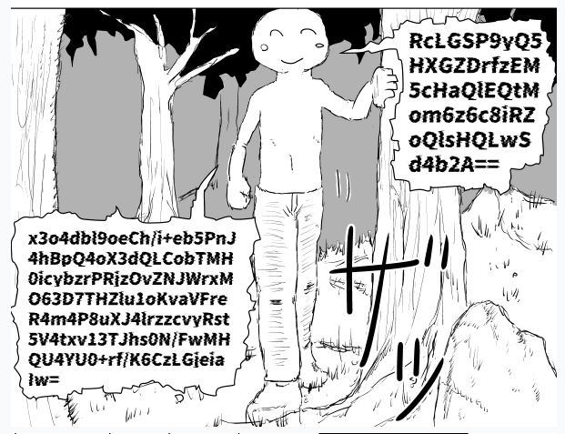
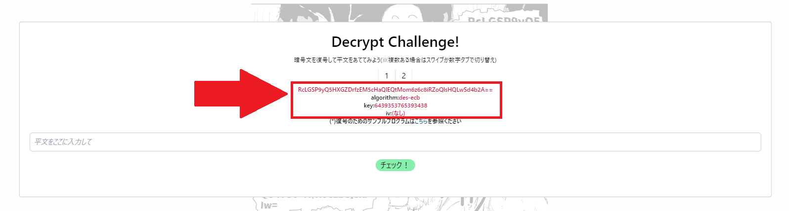
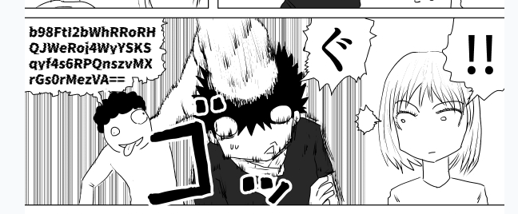
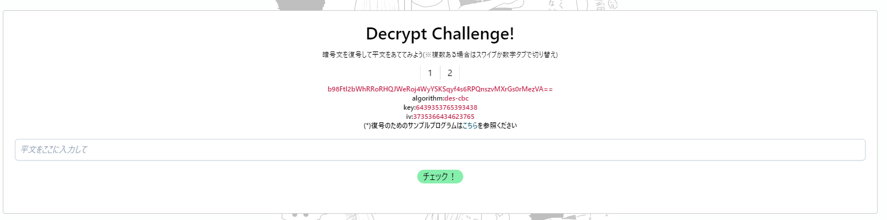

# What is this

There are some characters who speak encrypted words in my Manga site [RESIGN THREAT](https://www.resign-threat.com/). This repository offers some sample tools to decrypt the encrypted words. Please try to decrypt, then let it go viral on SNSs!

# How to use (decrypt des-ecb encrypted word)

1. Read my manga and find the image that a character speaks encrypted word. The example is below, it's [episode 01, page 7](https://www.resign-threat.com/story/01#01-07).  
   
2. Click or Tap the image. It opens a mdal window like this:  
   
3. You can find encrypted word, encryption algorithm, encryption key, initial vector (iv) on the area surrounded by red-line above image. The "Initial Vector" is not shown on this example image because of `des-ecb`, but you can find Initial Vector when other algorithm.
4. Then run `python des-ecb-decrypt-sample.py [encrypted word] [encryption key]`. In this case, run `python des-ecb-decrypt-sample.py RcLGSP9yQ5HXGZDrfzEM5cHaQlEQtMom6z6c8iRZoQlsHQLwSd4b2A== 6439353765393438`.
5. If you run successfully, you can observe a stdout like below. The decrypted word is shown next of `復号化された文字列:`.  
   ```
   復号化されたバイナリデータ: b'\xe4\...'
   復号化された文字列: ほげほげ
   ```
6. Enter the text on the modal window then click/tap [チェック!] button. If the text is correct, modal window shows "you're correct" like below. Please post it on SNSs and go viral!  
   

# How to use (decrypt des-cbc)

1. The steps are almost same as `des-ecb`, Read my manga and find the image that a character speaks encrypted word. The first time when the character who speaks `des-cbc` encrypted word appears is [episode 09, page 05](https://www.resign-threat.com/story/09#09-05). Here is the part of image:  
   
2. Click or Tap the image. It opens a mdal window like this:  
   
3. Then run `python des-ecb-decrypt-sample.py [encrypted word] [encryption key] [initial vector]`. In this case, run `python des-cbc-decrypt-sample.py 9MnyxB7oMdMVPSK15ZSwgmR6mdrCInrQFzPz/Z+oxoM= 6439353765393438 3735366434623765 `
4. If you run successfully, you can observe a stdout like below. The decrypted word is shown next of `復号化された文字列:`.  
   ```
   復号化されたバイナリデータ: b'\xe4\...'
   復号化された文字列: ほげほげ
   ```
5. Enter the text on the modal window then click/tap [チェック!] button. If the text is correct, modal window shows "you're correct" like below. Please post it on SNSs and go viral!  
   
